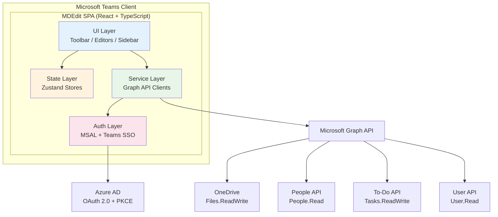
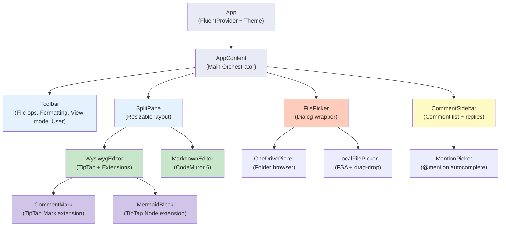
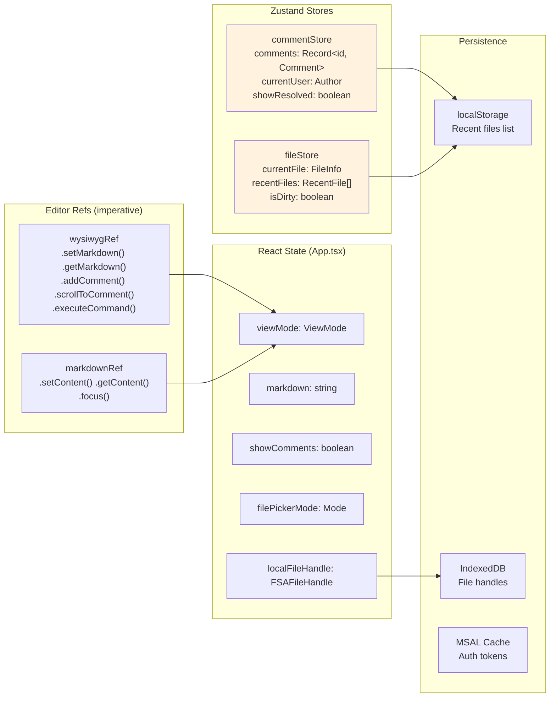
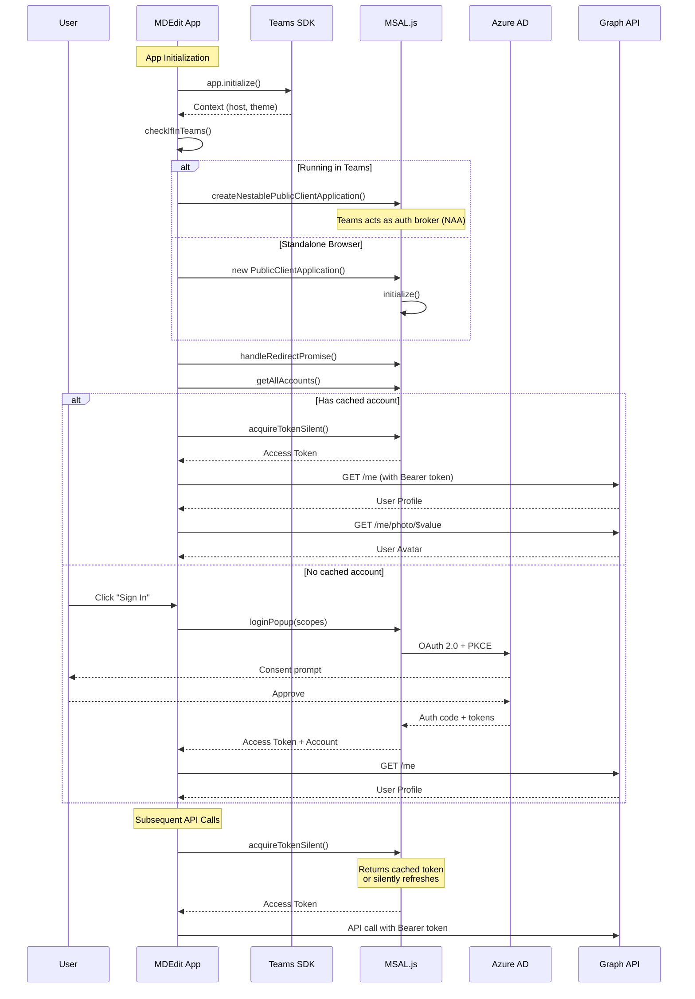
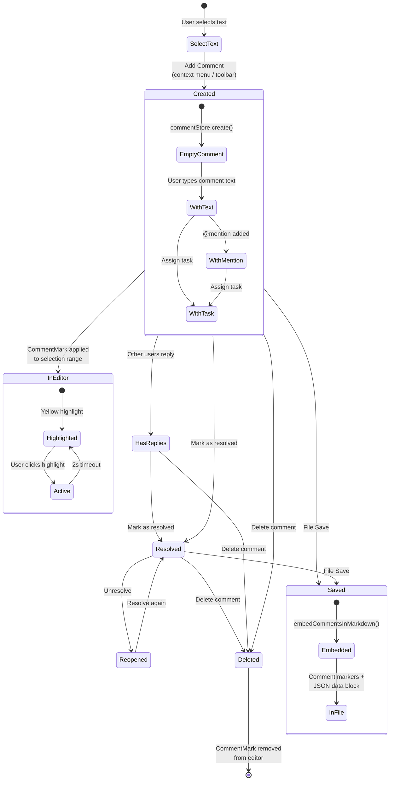
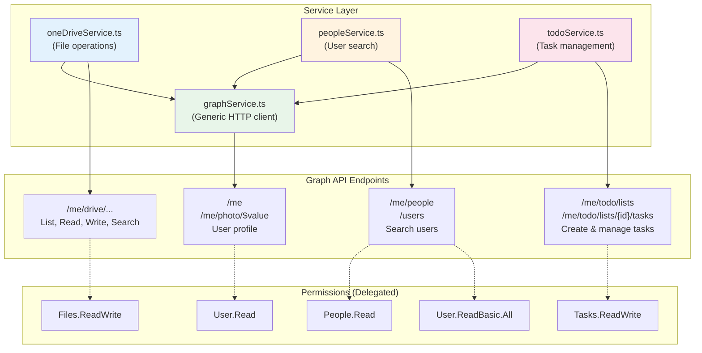
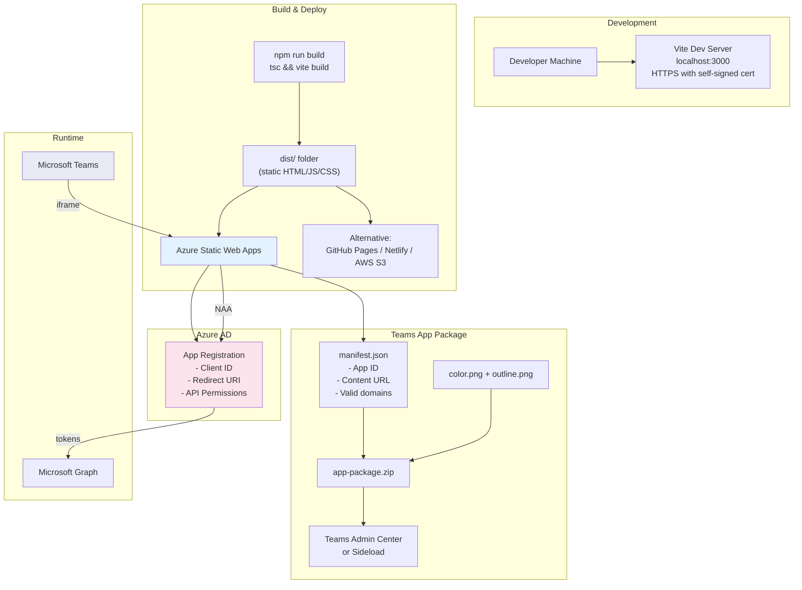
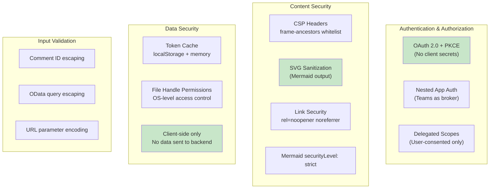
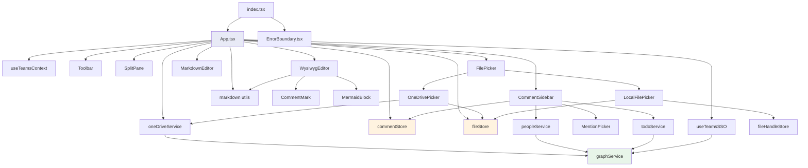

# MDEdit Teams - Detailed Design Document

## 1\. System Overview

MDEdit Teams is a Microsoft Teams personal tab application that provides a full-featured WYSIWYG markdown editor with commenting, OneDrive integration, and Mermaid diagram support. It is a 100% client-side Single Page Application (SPA) with no backend server, using Nested App Authentication (NAA) to access Microsoft Graph APIs.

### Key Design Decisions

<table style="min-width: 75px;"><colgroup><col style="min-width: 25px;"><col style="min-width: 25px;"><col style="min-width: 25px;"></colgroup><tbody><tr><th colspan="1" rowspan="1"><p>Decision</p></th><th colspan="1" rowspan="1"><p>Choice</p></th><th colspan="1" rowspan="1"><p>Rationale</p></th></tr><tr><td colspan="1" rowspan="1"><p>Architecture</p></td><td colspan="1" rowspan="1"><p>Client-side SPA</p></td><td colspan="1" rowspan="1"><p>No server infrastructure needed; deploys as static files</p></td></tr><tr><td colspan="1" rowspan="1"><p>Auth</p></td><td colspan="1" rowspan="1"><p>Nested App Authentication (NAA)</p></td><td colspan="1" rowspan="1"><p>Seamless SSO inside Teams; no token exchange endpoint</p></td></tr><tr><td colspan="1" rowspan="1"><p>Rich Text</p></td><td colspan="1" rowspan="1"><p>TipTap (ProseMirror)</p></td><td colspan="1" rowspan="1"><p>Extensible, schema-based editor with React integration</p></td></tr><tr><td colspan="1" rowspan="1"><p>Raw Markdown</p></td><td colspan="1" rowspan="1"><p>CodeMirror 6</p></td><td colspan="1" rowspan="1"><p>Best-in-class code editor with language support</p></td></tr><tr><td colspan="1" rowspan="1"><p>State</p></td><td colspan="1" rowspan="1"><p>Zustand</p></td><td colspan="1" rowspan="1"><p>Lightweight, minimal boilerplate vs Redux</p></td></tr><tr><td colspan="1" rowspan="1"><p>UI Framework</p></td><td colspan="1" rowspan="1"><p>Fluent UI v9</p></td><td colspan="1" rowspan="1"><p>Native Teams look-and-feel</p></td></tr><tr><td colspan="1" rowspan="1"><p>Build</p></td><td colspan="1" rowspan="1"><p>Vite</p></td><td colspan="1" rowspan="1"><p>Fast HMR, optimized builds, ESM-native</p></td></tr><tr><td colspan="1" rowspan="1"><p>Comment Storage</p></td><td colspan="1" rowspan="1"><p>Embedded in Markdown</p></td><td colspan="1" rowspan="1"><p>Portable; no external database required</p></td></tr></tbody></table>

---

## 2\. High-Level Architecture



---

## 3\. Component Architecture



---

## 4\. State Management



---

## 5\. Authentication Flow



---

## 6\. Editor Synchronization


---

## 7\. Comment Lifecycle



---

## 8\. File Operations Flow


---

## 9\. Comment Storage Format

Comments are stored directly within the markdown file using two mechanisms:

### Inline Markers (within content)

```
Some text <!--MDEDIT_COMMENT_START:uuid-1-->highlighted text<!--MDEDIT_COMMENT_END:uuid-1--> more text.
```

### Data Block (appended to end of file)

```
<!--MDEDIT_COMMENTS_DATA
[
  {
    "id": "uuid-1",
    "text": "This needs revision",
    "author": { "id": "user-id", "name": "John", "email": "john@example.com" },
    "createdAt": "2024-01-15T10:30:00.000Z",
    "updatedAt": "2024-01-15T10:30:00.000Z",
    "resolved": false,
    "replies": [],
    "quotedText": "highlighted text",
    "mentions": [],
    "assignedTo": null,
    "taskDueDate": null,
    "taskCompleted": false
  }
]
MDEDIT_COMMENTS_DATA-->
```


---

## 10\. Microsoft Graph API Integration



---

## 11\. TipTap Extension Architecture


---

## 12\. Deployment Architecture



---

## 13\. Security Model



---

## 14\. Module Dependency Graph



---

## 15\. Technology Stack Summary

<table style="min-width: 75px;"><colgroup><col style="min-width: 25px;"><col style="min-width: 25px;"><col style="min-width: 25px;"></colgroup><tbody><tr><th colspan="1" rowspan="1"><p>Layer</p></th><th colspan="1" rowspan="1"><p>Technology</p></th><th colspan="1" rowspan="1"><p>Version</p></th></tr><tr><td colspan="1" rowspan="1"><p>UI Framework</p></td><td colspan="1" rowspan="1"><p>React</p></td><td colspan="1" rowspan="1"><p>18.2</p></td></tr><tr><td colspan="1" rowspan="1"><p>Type System</p></td><td colspan="1" rowspan="1"><p>TypeScript</p></td><td colspan="1" rowspan="1"><p>5.4</p></td></tr><tr><td colspan="1" rowspan="1"><p>Design System</p></td><td colspan="1" rowspan="1"><p>Fluent UI v9</p></td><td colspan="1" rowspan="1"><p>9.46</p></td></tr><tr><td colspan="1" rowspan="1"><p>WYSIWYG Editor</p></td><td colspan="1" rowspan="1"><p>TipTap</p></td><td colspan="1" rowspan="1"><p>2.2</p></td></tr><tr><td colspan="1" rowspan="1"><p>Code Editor</p></td><td colspan="1" rowspan="1"><p>CodeMirror</p></td><td colspan="1" rowspan="1"><p>6.0</p></td></tr><tr><td colspan="1" rowspan="1"><p>Markdown Parser</p></td><td colspan="1" rowspan="1"><p>Mar<span data-comment-id="4add2172-ae0b-405d-b796-7855bde2586d" class="comment-highlight">ke</span>d</p></td><td colspan="1" rowspan="1"><p>12.0</p></td></tr><tr><td colspan="1" rowspan="1"><p>HTML-to-Markdown</p></td><td colspan="1" rowspan="1"><p>Turndown + GFM</p></td><td colspan="1" rowspan="1"><p>7.1</p></td></tr><tr><td colspan="1" rowspan="1"><p>Diagrams</p></td><td colspan="1" rowspan="1"><p>Mermaid</p></td><td colspan="1" rowspan="1"><p>11.12</p></td></tr><tr><td colspan="1" rowspan="1"><p>State Management</p></td><td colspan="1" rowspan="1"><p>Zustand</p></td><td colspan="1" rowspan="1"><p>4.5</p></td></tr><tr><td colspan="1" rowspan="1"><p>Authentication</p></td><td colspan="1" rowspan="1"><p>MSAL Browser</p></td><td colspan="1" rowspan="1"><p>5.1</p></td></tr><tr><td colspan="1" rowspan="1"><p>Teams SDK</p></td><td colspan="1" rowspan="1"><p>@microsoft/teams-js</p></td><td colspan="1" rowspan="1"><p>2.19</p></td></tr><tr><td colspan="1" rowspan="1"><p>Build Tool</p></td><td colspan="1" rowspan="1"><p>Vite</p></td><td colspan="1" rowspan="1"><p>5.1</p></td></tr><tr><td colspan="1" rowspan="1"><p>Linting</p></td><td colspan="1" rowspan="1"><p>ESLint</p></td><td colspan="1" rowspan="1"><p>9.0</p></td></tr></tbody></table>

<!--MDEDIT_COMMENTS_DATA
[
  {
    "id": "uuid-1",
    "text": "This needs revision",
    "author": {
      "id": "user-id",
      "name": "John",
      "email": "john@example.com"
    },
    "createdAt": "2024-01-15T10:30:00.000Z",
    "updatedAt": "2024-01-15T10:30:00.000Z",
    "resolved": false,
    "replies": [],
    "quotedText": "highlighted text",
    "mentions": [],
    "assignedTo": null,
    "taskDueDate": null,
    "taskCompleted": false,
    "resolvedAt": null
  },
  {
    "id": "4add2172-ae0b-405d-b796-7855bde2586d",
    "text": "testing 12345",
    "author": {
      "id": "anonymous",
      "name": "Anonymous",
      "email": ""
    },
    "createdAt": "2026-02-06T18:29:52.286Z",
    "updatedAt": "2026-02-06T18:30:01.782Z",
    "resolved": false,
    "resolvedBy": null,
    "resolvedAt": null,
    "replies": [],
    "assignedTo": null,
    "taskDueDate": null,
    "taskCompleted": false,
    "mentions": [],
    "quotedText": "ke"
  }
]
MDEDIT_COMMENTS_DATA-->